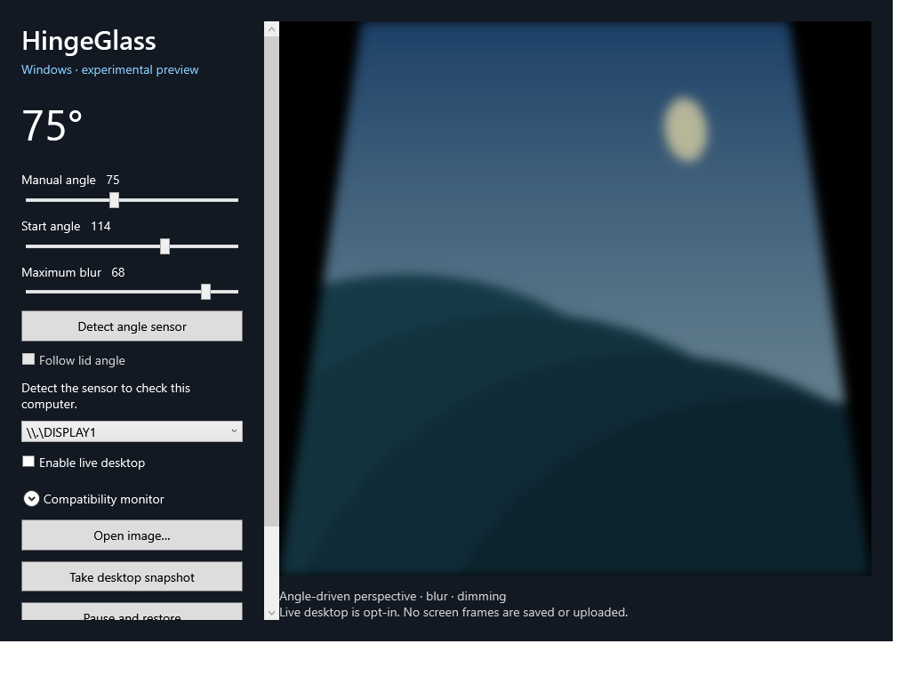

<h1 align="center">
  <picture>
    <source media="(prefers-color-scheme: dark)" srcset="docs/images/title-dark.svg">
    
  </picture>
</h1>

Desktop perspective, blur and dimming, controlled by a lid angle or a manual slider. The settings stay clear above the effect.

**macOS: stable release · Windows: experimental preview**

[Downloads](#download) · [Quick start](#run) · [Compatibility](#compatibility) · [中文 Mac 使用说明](使用说明.md) · [Windows guide](windows/README.md)

<h2 id="download"><picture>
  <source media="(prefers-color-scheme: dark)" srcset="docs/images/section-download-dark.svg">
  
</picture></h2>

| Platform | Current version | Download | Requirements |
| --- | --- | --- | --- |
| **macOS** | **1.1.1 · Stable** | [Mac ZIP](https://github.com/jdahd/HingeGlass/releases/download/v1.1.1/HingeGlass-1.1.1-macOS-arm64.zip) · [Release notes](https://github.com/jdahd/HingeGlass/releases/tag/v1.1.1) | macOS 14+, Apple silicon MacBook with a compatible lid-angle sensor |
| **Windows** | **0.2.1 · Preview** | [Setup.exe](https://github.com/jdahd/HingeGlass/releases/download/windows-v0.2.1-preview/HingeGlass-0.2.1-Windows-x64-Setup.exe) · [Portable ZIP](https://github.com/jdahd/HingeGlass/releases/download/windows-v0.2.1-preview/HingeGlass-0.2.1-Windows-x64-preview.zip) | Windows 10 2004+ / Windows 11, x64; automatic following requires a compatible sensor |

**No angle sensor? Windows manual desktop effects still work.** A successful installation does not mean the laptop can report its lid angle. See [compatibility](#compatibility) before expecting automatic lid following.

Use the app packages above to install. GitHub's **Source code (zip)** contains the source project. The sidebar's **Latest** badge currently points to the stable Mac release; the Windows preview has its own download links above.

<p align="center">
  
  <br><sub>macOS — floating settings with adjustable glass transparency.</sub>
</p>

<details>
<summary>Windows preview</summary>

<p align="center">
  
</p>

Windows includes opt-in live desktop effects, manual angle control and a compatibility monitor. The image shows the in-app landscape preview. The Windows UI and rendering pipeline differ from macOS.

</details>

<h2 id="run"><picture>
  <source media="(prefers-color-scheme: dark)" srcset="docs/images/section-run-dark.svg">
  
</picture></h2>

### macOS

1. Unzip the Mac package and move **HingeGlass.app** to Applications.
2. For the Desktop scene, allow HingeGlass in **System Settings → Privacy & Security → Screen & System Audio Recording**. Reopen if prompted.
3. Set **Start angle** and **Maximum blur**, then click **Enable**.
4. Use **Restore**, the menu-bar **Pause and Restore**, or **Control–Option–Command–Escape** to restore the desktop.

The Mac app is ad hoc signed, not Apple-notarized. If macOS blocks it, review the warning in **Privacy & Security** and use **Open Anyway** if available. [中文使用说明](使用说明.md)

### Windows

1. Run **Setup.exe**, choose the **Installation folder** or click **Change…**, then install. For portable use, extract the entire ZIP and open **HingeGlass.exe**.
2. Select a display and check **Enable live desktop**. Lower **Manual angle** below **Start angle** to try the effect.
3. For physical lid following, click **Detect angle sensor**, move the lid slowly and inspect **Compatibility monitor**. Enable **Follow lid angle** only after verifying readings and direction.
4. Use **Pause and restore** or **Ctrl + Alt + Esc** to restore the desktop.

Setup installs for the current user into a writable folder and adds a Start menu entry. It is unsigned, so Windows may show a reputation warning. [Full Windows guide](windows/README.md)

## Compatibility

| Capability | macOS 1.1.1 | Windows 0.2.1 |
| --- | --- | --- |
| Live desktop perspective, blur and dimming | Available | Available, experimental |
| Automatic lid following | Requires a compatible built-in sensor | Requires a sensor exposed through the supported Windows API |
| Manual full-screen effect without angle readings | Preview controls available | Available with Manual angle |
| Sensor diagnostics and angle history | Connection status | Compatibility monitor and copyable diagnostics |
| Glass settings, light/dark appearance and transparency slider | Available | Not implemented in the Windows app |
| Packaging | Apple silicon Mac ZIP | x64 Setup and portable ZIP |

**“No compatible API sensor” means the current interface did not find an angle sensor.** It is not a rendering failure, and it does not prove that no manufacturer-specific hardware interface exists. An open/closed lid switch alone cannot supply continuous angles. No Windows laptop model is certified for automatic following by this project.

Windows captures at up to **1600 pixels wide and at most 30 capture cycles/second**, using CPU/GDI capture and WPF effects. Render callbacks in diagnostics are not GPU presentation FPS. Performance, protected content and mixed-DPI/multi-monitor behavior still need real-device validation. Mouse input reaches original desktop coordinates; the perspective effect does not remap clicks.

There is no Intel Mac build. Windows ARM and HarmonyOS are not validated targets.

<h2 id="window-appearance"><picture>
  <source media="(prefers-color-scheme: dark)" srcset="docs/images/section-window-appearance-dark.svg">
  
</picture></h2>

These controls are currently available in the **Mac app**:

- **Glass background** switches between frosted glass and a solid settings window.
- **Transparency** adjusts the background from full material (0%) to fully clear (100%); text and controls remain opaque.
- **System / Light / Dark** follows the system or selects a fixed appearance.

Settings are saved. macOS **Reduce transparency** takes precedence and uses a solid background. These options affect the settings window, not the desktop effect.

## Privacy and recovery

Desktop frames are processed in memory while the effect is active. Normal use does not capture audio, save screen recordings or upload screen frames. Normal lid-close sleep is preserved.

Windows pauses on sleep, lock, display changes and capture errors. Opening past the start angle removes its overlay and stops capture while leaving live mode armed. Closing the app stops the effect. **Copy diagnostics** includes software/OS and measurements, not hardware serial numbers or screen images.

<h2 id="release"><picture>
  <source media="(prefers-color-scheme: dark)" srcset="docs/images/section-release-dark.svg">
  
</picture></h2>

- **[macOS 1.1.1](https://github.com/jdahd/HingeGlass/releases/tag/v1.1.1)** — adjustable glass transparency. [Mac release notes](RELEASE_NOTES.md)
- **[Windows 0.2.1 Preview](https://github.com/jdahd/HingeGlass/releases/tag/windows-v0.2.1-preview)** — selectable Setup destination, live desktop effects and compatibility monitoring. [Windows release notes](windows/RELEASE_NOTES.md)
- [Previous releases](https://github.com/jdahd/HingeGlass/releases) remain available for version history and rollback.

<h2 id="development"><picture>
  <source media="(prefers-color-scheme: dark)" srcset="docs/images/section-development-dark.svg">
  
</picture></h2>

<details>
<summary>Build instructions and repository map</summary>

| Location | Purpose |
| --- | --- |
| `Sources/`, `Resources/`, `Info.plist` | Native macOS application and assets |
| `windows/HingeGlass.Windows/` | Windows app, capture, effects and diagnostics |
| `windows/HingeGlass.Setup/`, `windows/installer/` | Animated Windows installer and installation payload |
| `docs/images/` | README screenshots and animated text assets |
| `scripts/`, `build.sh` | Mac icon, build and packaging scripts |
| `.github/workflows/` | Windows build, checks and preview publication |
| `ThirdPartyNotices/` | Third-party attribution and license notices |

**macOS:** run `./scripts/make-icon.sh`, `./build.sh`, then `./scripts/package.sh`. Packages are written to `releases/`.

**Windows:** from the repository root:

```powershell
dotnet publish windows/HingeGlass.Windows/HingeGlass.Windows.csproj -c Release -r win-x64 --self-contained true
```

Windows CI checks effect boundaries, UI startup, live capture exclusion, pointer pass-through, recovery, and installer/uninstaller behavior. These checks do not substitute for physical laptop sensor testing. Local build output and development records are excluded from the repository.

</details>

## Credits

The effect implementation adapts Ruixiang Huang’s **Macbook_Duo_Effect** under the MIT license. [Full third-party notice](ThirdPartyNotices/Macbook_Duo_Effect.txt) is also bundled in the app and release packages. The HingeGlass icon was created with OpenAI image generation.

For Windows feedback, include the computer model and **Copy diagnostics** output in a [GitHub issue](https://github.com/jdahd/HingeGlass/issues). Report manual effects and automatic lid following separately.
