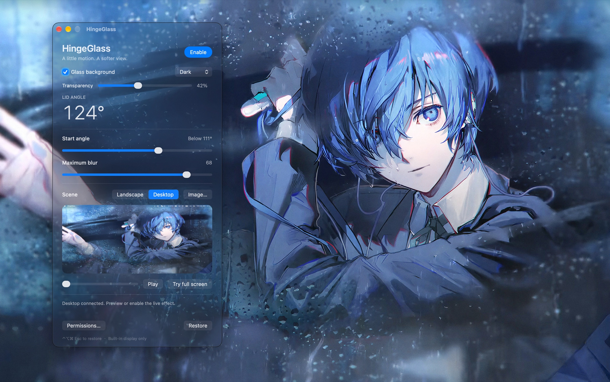

<h1 align="center">
  <picture>
    <source media="(prefers-color-scheme: dark)" srcset="docs/images/title-dark.svg">
    
  </picture>
</h1>

A quiet lid effect for your Mac. As you close the display, your live desktop gains perspective, progressive blur and dimming. The English settings panel stays clear and floats above the effect.

  

Dark glass appearance with adjustable background transparency.

<h2 id="download"><picture>
  <source media="(prefers-color-scheme: dark)" srcset="docs/images/section-download-dark.svg">
  
</picture></h2>

[Download HingeGlass for macOS](https://github.com/jdahd/HingeGlass/releases/latest) · [中文使用说明](使用说明.md)

Choose `HingeGlass-1.1.1-macOS-arm64.zip`, unzip it, and move `HingeGlass.app` to Applications. This release is for Apple silicon MacBooks running macOS 14 or later with a compatible built-in lid-angle sensor. For the experimental Windows x64 preview, see [Windows preview download](https://github.com/jdahd/HingeGlass/releases/tag/windows-v0.1.1-preview) ([instructions](windows/README.md)). There is no Intel Mac build.

The app is ad hoc signed and not Apple-notarized. If macOS blocks it, review the warning in System Settings → Privacy & Security and use Open Anyway if available.

<h2 id="run"><picture>
  <source media="(prefers-color-scheme: dark)" srcset="docs/images/section-run-dark.svg">
  
</picture></h2>

Open `HingeGlass.app`. Requires macOS 14 or later, Apple silicon, and a compatible built-in lid-angle sensor. Allow HingeGlass in System Settings → Privacy & Security → Screen & System Audio Recording for the Desktop scene, then reopen if prompted.

Use **Start angle** and **Maximum blur** to tune the effect. Click **Enable** to follow the physical lid. Your saved settings are preserved. **Restore**, the menu-bar **Pause and Restore** action, or **Control–Option–Command–Escape** restores the desktop. Normal lid-close sleep is preserved.

Screen frames are processed in memory while the effect is active. No audio is captured, and screen footage is neither saved nor uploaded.

<h2 id="window-appearance"><picture>
  <source media="(prefers-color-scheme: dark)" srcset="docs/images/section-window-appearance-dark.svg">
  
</picture></h2>

- **Glass background** enables a native frosted glass background for the control window. Turn it off for a solid background.
- **Transparency** adjusts the glass background from full material (0%) to fully clear (100%). Text and controls stay opaque. The value is saved; the slider is available when Glass background is enabled and macOS Reduce transparency is off.
- **System / Light / Dark** follows macOS appearance or chooses a fixed light or dark window.
- Both choices are saved. macOS **Reduce transparency** takes precedence and uses a solid background.

These options change the control window only; the lid effect and desktop capture are unchanged.

<h2 id="release"><picture>
  <source media="(prefers-color-scheme: dark)" srcset="docs/images/section-release-dark.svg">
  
</picture></h2>

1.0 packages the lid effect with an application icon, About panel, bundled credits and documentation. This local build is ad hoc signed and is not Apple notarized. Rebuilding can require refreshing the Screen Recording permission.

<h2 id="development"><picture>
  <source media="(prefers-color-scheme: dark)" srcset="docs/images/section-development-dark.svg">
  
</picture></h2>

Run `./scripts/make-icon.sh`, `./build.sh`, then `./scripts/package.sh`. The release ZIP is written to `releases/`. Local build output and development records are excluded from this repository.

The effect implementation adapts Ruixiang Huang’s Macbook_Duo_Effect under the MIT license. Full attribution is included in `Macbook_Duo_Effect.txt` in the release and inside the application Resources. The icon was created with OpenAI image generation.
